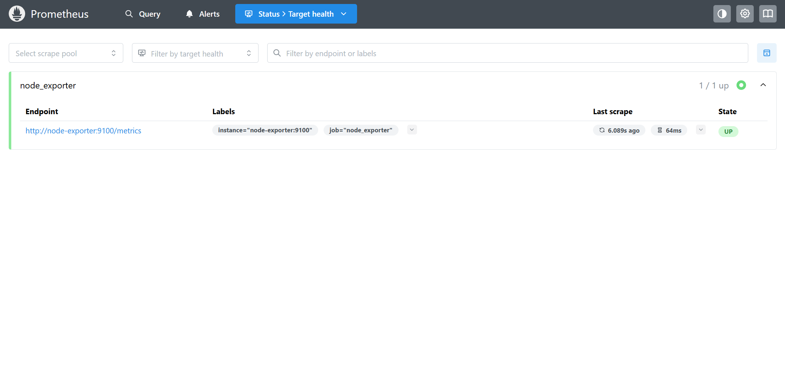
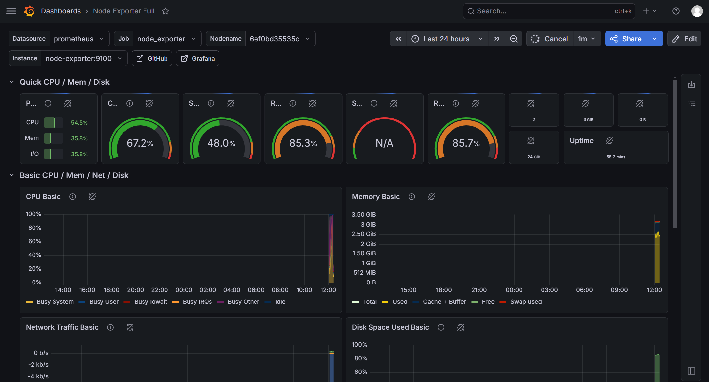

# Prometheus + Grafana Host Monitoring Stack

[](LICENSE)
[](https://docs.docker.com/compose/)

A complete host monitoring system based on Prometheus and Grafana, deployable with a single `docker-compose up -d` .

## Features

- **Node Exporter** - Collects host metrics (CPU, memory, disk, network, etc.)
- **Prometheus** - Scrapes and stores time-series data
- **Grafana** - Visualizes metrics with pre-built dashboards
- **All components** run in Docker containers, no host installation required

## Prerequisites

- Docker (20.10+)
- Docker Compose (1.29+ or the 'docker compose' plugin)
- A Linux host (tested on Ubuntu 22.04)

## Quick Start

```bash
# Clone the repository
git clone https://github.com/study-lee/monitoring-demo.git
cd monitoring-demo

# Start the stack
docker-compose up -d
```

After starting, access Prometheus at http://localhost:9090 and Grafana at http://localhost:3000 (default admin/admin)

## Access the services

| Service   | URL                 | Default credentials|
|-----------|---------------------|--------------------|
|Prometheus |http://localhost:9090| -                  |
|Grafana    |http://localhost:3000| admin / admin      |

Prometheus targets: http://localhost:9090/targets
Grafana dashboards: import Node Exporter Full ( ID 1860 ) after adding Prometheus as a data source (http://prometheus:9090).

## Screenshots




## Configuration

- Prometheus (prometheus.yml)
The default configuration scrapes node-exporter:9100 every 15 seconds.You can add more scrape jobs (e.g., for your own applications).
```yaml
scrape_configs:
  - job_name: 'node_exporter'
    static_configs:
      - targets: ['node-exporter:9100']
```
**Adding more exporters**
Simply add new services to docker-compose.yml (e.g., mysqld_exporter , redis_exporter) and updata prometheus.yml

## Verification

Check container status: `docker-compose ps`
Query Prometheus API:
`curl http://localhost:9090/api/v1/query?query=up`
Logs: `docker-compose logs -f`

## Project Structure
```text
.
├── screenshots
│   ├── grafana-dashboard.png
│   └── prometheus-targets.png
├── docker-compose.yml
├── prometheus.yml
└── README.md
```

## Troubleshooting

### Slow image pulling / timeout
Use a Docker registry mirror (e.g., docker.m.daocloud.io)
Pre-pull images manually:
```bash
docker pull prom/node-exporter:latest
docker pull prom/prometheus:latest
docker pull grafana/grafana:latest
```
### Port conflicts ( address already in use )
Change host ports in docker-compose.yml (e.g., "9091:9090").

### "Permission denied" on shared folders (VirtualBox)
add your user to the vboxsf group:
`sudo usermod -aG vboxsf $USER`
Then log out and log back in

## Credits

- Node Exporter, Prometheus, Grafana are official images from [Prometheus Community](https://prometheus.io/) and [Grafana Labs](https://grafana.com).
- Dashboard ID 1860 is provided by the Prometheus community.

## License
MIT - free to use and modify

## Contributing
Issues and PRs are welcome.Feel free to add more exporters or custom dashboards.

**Happy Monitoring!**
